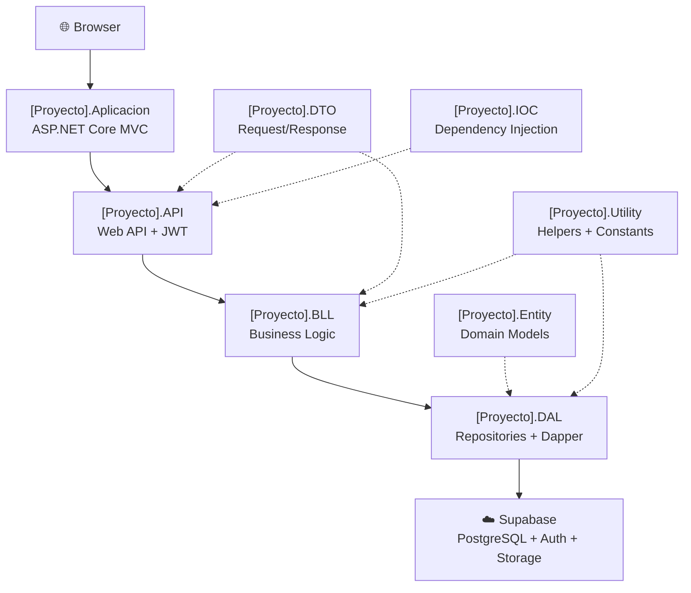
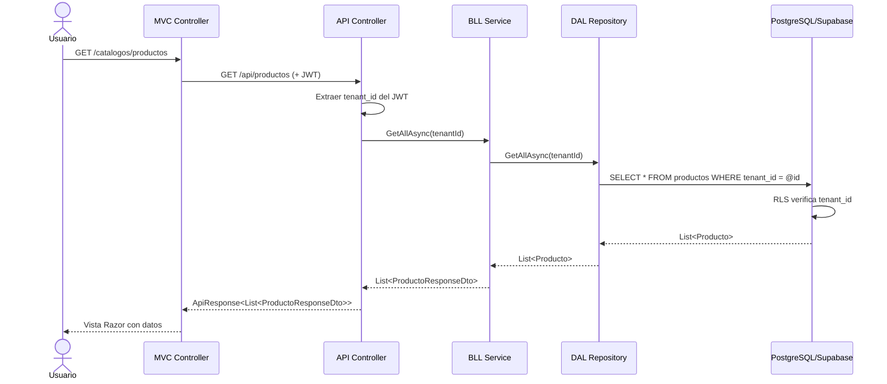

# Arquitectura de Software — SaaS Multi-Tenant con Supabase

> **Documento de arquitectura de referencia**
> Describe la arquitectura N-Tier aplicada al stack ASP.NET Core + Supabase.
> Usar como plantilla para cualquier nuevo proyecto SaaS en este stack.

---

## 1. Visión General de la Arquitectura

### Patrón Arquitectónico: N-Capas (N-Tier) + MVC + Repository

El sistema sigue una arquitectura de **N-capas estricta**, separada en proyectos independientes dentro de una misma solución .NET. La separación de responsabilidades es absoluta y se aplica mediante interfaces y el principio de inversión de dependencias (DIP).

```
┌─────────────────────────────────────────────────────────────┐
│                    CLIENTE (Browser)                        │
└─────────────────────┬───────────────────────────────────────┘
                      │ HTTP/HTTPS
┌─────────────────────▼───────────────────────────────────────┐
│              [Proyecto].Aplicacion                          │
│         (ASP.NET Core MVC — Capa de Presentación)           │
│   Areas / Controllers / Views (.cshtml) / wwwroot           │
└─────────────────────┬───────────────────────────────────────┘
                      │ HTTP interno / Service injection
┌─────────────────────▼───────────────────────────────────────┐
│                  [Proyecto].API                             │
│           (ASP.NET Core Web API — REST Endpoints)           │
│   Controllers / Swagger / JWT Auth / SignalR                │
└─────────────────────┬───────────────────────────────────────┘
                      │ Interface injection (DI)
┌─────────────────────▼───────────────────────────────────────┐
│                  [Proyecto].BLL                             │
│          (Business Logic Layer — Reglas de negocio)         │
│   Services / FluentValidation / Domain Rules                │
└─────────────────────┬───────────────────────────────────────┘
                      │ Interface injection (DI)
┌─────────────────────▼───────────────────────────────────────┐
│                  [Proyecto].DAL                             │
│          (Data Access Layer — Acceso a datos)               │
│   Repositories / Dapper / SQL queries                       │
└─────────────────────┬───────────────────────────────────────┘
                      │ NpgsqlConnection (via Supabase)
┌─────────────────────▼───────────────────────────────────────┐
│                     SUPABASE                                │
│   PostgreSQL 15 | Auth | Realtime | Storage | RLS           │
└─────────────────────────────────────────────────────────────┘
```

### Proyectos de soporte (sin UI ni acceso a BD)

```
[Proyecto].Entity   → Modelos de dominio (clases C# que mapean tablas)
[Proyecto].DTO      → Objetos de transferencia (Request/Response)
[Proyecto].IOC      → Registro de inyección de dependencias
[Proyecto].Utility  → Helpers, extensiones, constantes
```

---

## 2. Flujo de Datos Obligatorio

### Lectura (GET)

```
Browser → [GET /area/modulo] → Controller MVC
       → [GET /api/modulo]   → API Controller
       → IModuloService      → BLL Service
       → IModuloRepository   → DAL Repository
       → [SELECT * FROM modulo WHERE clinica_id = @id]
       → PostgreSQL (Supabase)
       ← List<Entity>
       ← List<ResponseDto>
       ← ApiResponse<List<ResponseDto>>
       ← JSON (HTTP 200)
       ← Renderizado en vista Razor
```

### Escritura (POST/PUT)

```
Browser → [POST /area/modulo] → Controller MVC
        → [POST /api/modulo]  → API Controller
        → FluentValidation (DTO)
        → IModuloService      → BLL Service
        → [Reglas de negocio]
        → IModuloRepository   → DAL Repository
        → [INSERT/UPDATE ... WHERE clinica_id = @id]
        → PostgreSQL (Supabase + RLS)
        ← new Guid (id generado)
        ← ResponseDto
        ← ApiResponse<ResponseDto>
        ← JSON (HTTP 201 / 200)
        ← Redirect + mensaje de éxito
```

### Regla absoluta de capas

| ❌ PROHIBIDO | ✅ CORRECTO |
|---|---|
| Controller MVC llama DAL directamente | Controller MVC llama API Controller |
| API Controller llama DAL directamente | API Controller llama BLL Service |
| BLL Service contiene SQL | BLL Service llama DAL Repository |
| Vista Razor contiene lógica de negocio | Vista Razor solo presenta datos |
| Entity retornada directamente por API | API siempre retorna DTO |

---

## 3. Modelo Multi-Tenant

### Principio fundamental

Cada tenant (empresa/organización) tiene sus datos completamente aislados. El campo `tenant_id` (o `clinica_id`, `empresa_id`, etc. según el dominio) es el discriminador universal y debe estar presente en **todas** las tablas de negocio.

### Implementación de RLS en PostgreSQL

```sql
-- Paso 1: Agregar discriminador de tenant a la tabla
ALTER TABLE [tabla] ADD COLUMN tenant_id UUID NOT NULL REFERENCES tenants(id);

-- Paso 2: Habilitar RLS
ALTER TABLE [tabla] ENABLE ROW LEVEL SECURITY;

-- Paso 3: Crear política de aislamiento
CREATE POLICY "tenant_isolation" ON [tabla]
  FOR ALL
  USING (tenant_id = (current_setting('app.current_tenant_id', true))::UUID);
```

### Flujo de autenticación multi-tenant

```
1. Usuario se autentica → Supabase Auth valida credenciales
2. JWT generado contiene: user_id, tenant_id, perfil_id, permisos[]
3. Cada request incluye Authorization: Bearer {jwt_token}
4. Middleware del API extrae tenant_id del JWT → lo inyecta como claim
5. DAL Repository usa tenant_id en TODAS las consultas
6. RLS de PostgreSQL lo aplica como segunda capa de seguridad
```

### Campos obligatorios en toda tabla de negocio

```sql
id                  UUID PRIMARY KEY DEFAULT gen_random_uuid(),
tenant_id           UUID NOT NULL REFERENCES tenants(id),
activo              BOOLEAN NOT NULL DEFAULT true,
fecha_creacion      TIMESTAMPTZ NOT NULL DEFAULT NOW(),
fecha_modificacion  TIMESTAMPTZ
```

---

## 4. Estructura de un Módulo Completo

Para cualquier módulo (ejemplo: `Producto`, `Cliente`, `Pedido`), la estructura es siempre la misma:

```
[Proyecto].Entity/
  └── [Modulo].cs                            ← Mapea la tabla de BD

[Proyecto].DTO/
  ├── [Modulo]/[Modulo]RequestDto.cs         ← Datos de entrada
  └── [Modulo]/[Modulo]ResponseDto.cs        ← Datos de salida

[Proyecto].DAL/
  ├── Interfaces/I[Modulo]Repository.cs      ← Contrato de acceso a datos
  └── Repositories/[Modulo]Repository.cs     ← Implementación con Dapper

[Proyecto].BLL/
  ├── Interfaces/I[Modulo]Service.cs         ← Contrato de negocio
  └── Services/[Modulo]Service.cs            ← Reglas de negocio + validación

[Proyecto].API/
  └── Controllers/[Modulo]Controller.cs      ← REST endpoints + Swagger

[Proyecto].Aplicacion/
  └── Areas/[Area]/
      ├── Controllers/[Modulo]Controller.cs  ← Controller MVC
      └── Views/[Modulo]/
          ├── Index.cshtml                   ← Listado
          ├── Create.cshtml                  ← Formulario crear
          └── Edit.cshtml                    ← Formulario editar

[Proyecto].IOC/
  └── DependencyInjection.cs                 ← Registro I[Modulo]Service → [Modulo]Service

tests/
  ├── [Proyecto].BLL.Tests/
  │   └── [Modulo]ServiceTests.cs            ← Tests unitarios
  └── [Proyecto].API.Tests/
      └── [Modulo]ControllerTests.cs         ← Tests de integración

supabase/migrations/
  └── YYYYMMDDHHMMSS_create_[modulo].sql     ← Migración SQL
```

---

## 5. Supabase como BaaS — Componentes Utilizados

| Componente | Uso | Tecnología |
|---|---|---|
| **PostgreSQL 15** | Base de datos principal | Dapper + SQL nativo |
| **Supabase Auth** | Autenticación + JWT | Supabase Auth SDK |
| **Row Level Security** | Aislamiento multi-tenant | PostgreSQL RLS |
| **Realtime** | Actualizaciones en vivo | Supabase JS Client |
| **Storage** | Archivos (PDF, imágenes) | Supabase Storage SDK |
| **Edge Functions** | Lógica serverless auxiliar | Deno + TypeScript |
| **PostgREST** | API REST auto-generada | PostgREST (Supabase) |
| **Supabase CLI** | Migraciones y entorno local | supabase CLI |

### Estructura de buckets de Storage

```
[proyecto]-files/        ← Archivos de trabajo por tenant
  └── {tenant_id}/
      └── {entidad_id}/
          └── {uuid}.{ext}

avatares/                ← Fotos de perfil de usuarios
  └── {user_id}.{ext}
```

### Reglas de Storage

- Todos los buckets son **privados** por defecto.
- Las URLs públicas se generan con tokens de acceso de duración limitada.
- Los paths incluyen `{tenant_id}` para garantizar el aislamiento.

---

## 6. Modelo de Permisos Granulares

### Tipos de Permiso

| Permiso | Código | HTTP Method | Descripción |
|---|---|---|---|
| Leer | `READ` | GET | Visualizar listados y registros |
| Crear | `CREATE` | POST | Insertar nuevos registros |
| Actualizar | `UPDATE` | PUT / PATCH | Editar registros existentes |

> **No existe permiso de eliminación.** Los registros solo cambian de `activo = true` a `activo = false`.

### Implementación en el API Controller

```csharp
[HttpGet]
[Authorize]
[RequirePermission("productos", PermissionType.Read)]
public async Task<IActionResult> GetAll() { ... }

[HttpPost]
[Authorize]
[RequirePermission("productos", PermissionType.Create)]
public async Task<IActionResult> Create([FromBody] ProductoRequestDto dto) { ... }

[HttpPut("{id}")]
[Authorize]
[RequirePermission("productos", PermissionType.Update)]
public async Task<IActionResult> Update(Guid id, [FromBody] ProductoRequestDto dto) { ... }
```

### Estructura de la tabla de permisos en BD

```sql
CREATE TABLE permisos (
    id          UUID PRIMARY KEY DEFAULT gen_random_uuid(),
    perfil_id   UUID NOT NULL REFERENCES perfiles(id),
    modulo      VARCHAR(100) NOT NULL,
    tipo        VARCHAR(20) NOT NULL CHECK (tipo IN ('READ', 'CREATE', 'UPDATE')),
    activo      BOOLEAN NOT NULL DEFAULT true,
    fecha_creacion TIMESTAMPTZ NOT NULL DEFAULT NOW()
);
```

---

## 7. Tiempo Real — Supabase Realtime + SignalR

### Cuándo usar cada tecnología

| Caso de Uso | Tecnología | Razón |
|---|---|---|
| Actualizaciones de BD en vivo (ej: nuevas filas) | Supabase Realtime | Integración nativa con PostgreSQL NOTIFY |
| Notificaciones push del servidor al cliente | SignalR | Control fino sobre mensajes y grupos |
| Estado en tiempo real del UI | Supabase JS Client | Suscripciones directas al canal |

### Ejemplo de suscripción con Supabase Realtime

```javascript
// En el cliente (JavaScript/Razor)
const channel = supabase.channel('cola-espera')
  .on('postgres_changes', {
    event: 'INSERT',
    schema: 'public',
    table: 'cola_espera',
    filter: `doctor_id=eq.${doctorId}`
  }, (payload) => {
    actualizarColaUI(payload.new);
  })
  .subscribe();
```

---

## 8. Validación en Dos Capas

### Capa 1: Servidor — FluentValidation (BLL)

```csharp
public class ProductoValidator : AbstractValidator<ProductoRequestDto>
{
    public ProductoValidator()
    {
        RuleFor(x => x.Nombre)
            .NotEmpty().WithMessage("El nombre es obligatorio")
            .MaximumLength(200).WithMessage("El nombre no puede exceder 200 caracteres");

        RuleFor(x => x.Precio)
            .GreaterThan(0).WithMessage("El precio debe ser mayor a 0");
    }
}
```

### Capa 2: Cliente — jQuery Validate (Vista)

```html
<!-- En la vista Razor -->
<form id="formProducto">
    <input type="text" id="nombre" name="Nombre"
           data-val="true"
           data-val-required="El nombre es obligatorio"
           data-val-length-max="200"
           data-val-length="No puede exceder 200 caracteres" />
    <!-- ... -->
</form>
<script>
  $.validator.unobtrusive.parse('#formProducto');
</script>
```

### Principio de validación

> **Nunca confiar solo en la validación del cliente.** La validación del servidor (FluentValidation) es la única que cuenta para la seguridad. La validación del cliente es solo UX.

---

## 9. Respuestas Estándar de la API

### Wrapper ApiResponse<T>

```csharp
public class ApiResponse<T>
{
    public bool Success { get; set; }
    public string Message { get; set; } = string.Empty;
    public T? Data { get; set; }
    public List<string> Errors { get; set; } = new();
    public DateTime Timestamp { get; set; } = DateTime.UtcNow;
}
```

### Códigos HTTP estándar

| Situación | Código HTTP | Ejemplo |
|---|---|---|
| Lectura exitosa | 200 OK | `GetAll()`, `GetById()` |
| Creación exitosa | 201 Created | `Create()` |
| Actualización exitosa | 200 OK | `Update()` |
| Desactivación exitosa | 200 OK | `Deactivate()` |
| Validación fallida | 400 Bad Request | FluentValidation falla |
| No autorizado | 401 Unauthorized | Token inválido |
| Sin permiso | 403 Forbidden | RequirePermission falla |
| No encontrado | 404 Not Found | ID no existe |
| Error interno | 500 Server Error | Excepción no controlada |

---

## 10. CI/CD Pipeline — GitHub Actions

### Pipeline básico

```yaml
# .github/workflows/ci.yml
name: CI

on:
  push:
    branches: [main, develop]
  pull_request:
    branches: [main]

jobs:
  test:
    runs-on: ubuntu-latest
    steps:
      - uses: actions/checkout@v4
      - uses: actions/setup-dotnet@v4
        with:
          dotnet-version: '8.0.x'
      - run: dotnet restore
      - run: dotnet build --no-restore
      - run: dotnet test --no-build --verbosity normal

  deploy-staging:
    needs: test
    runs-on: ubuntu-latest
    if: github.ref == 'refs/heads/develop'
    steps:
      - uses: actions/checkout@v4
      - run: supabase db push --project-ref ${{ secrets.SUPABASE_PROJECT_REF }}
      - run: dotnet publish -c Release -o ./publish
      # ... deploy steps
```

---

## 11. Diagramas de Arquitectura

### Diagrama de capas (Mermaid)



### Diagrama de flujo multi-tenant (Mermaid)



---

*arquitectura.md — Documento de arquitectura de referencia para SaaS*
*Versión: 1.0.0 | Basada en las mejores prácticas del proyecto Vittal (2026)*
